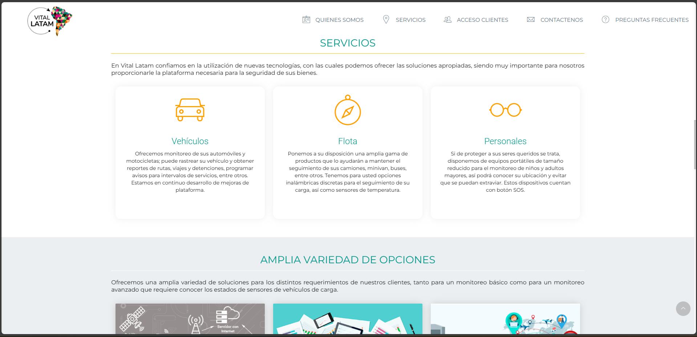

# 🌐 Vital Latam – Corporate Website Modernization

> Modernización de un sitio corporativo legacy mediante la eliminación de dependencias de jQuery y la adopción de JavaScript ES6+, manteniendo la funcionalidad existente y mejorando el rendimiento.

[](https://jfva01.github.io/VitalLatam_WebSite)


---

## 📋 Descripción

Este proyecto corresponde a la modernización de un sitio web corporativo desarrollado originalmente con una arquitectura frontend basada en **jQuery**.

El objetivo fue eliminar la dependencia legacy, actualizar el código a estándares modernos de JavaScript y optimizar el rendimiento del sitio, manteniendo la experiencia de usuario y la compatibilidad con los componentes existentes de Materialize.

---

## 📷 Vista previa

<p align="center">
  
</p>

---

# 🚀 Principales mejoras

### ✅ Eliminación de jQuery

- Migración de funcionalidades a JavaScript ES6+
- Eliminación de dependencia legacy
- Código más limpio y mantenible

### ✅ Refactorización Frontend

- Reorganización de archivos JavaScript
- Limpieza y simplificación de CSS
- Optimización de assets

### ✅ Optimización de rendimiento

- Reducción del peso de recursos
- Menor cantidad de JavaScript cargado
- Mejor tiempo de carga

### ✅ Responsive Design

- Corrección de inconsistencias visuales
- Mejor experiencia en dispositivos móviles
- Ajustes de layout y navegación

---

# 🛠 Tecnologías

- HTML5
- CSS3
- JavaScript ES6+
- Materialize CSS
- Responsive Design

---

# 📂 Estructura

```
assets/
│
├── css/
├── js/
├── images/
├── fonts/
│
index.html
faq.html
```

---

# 💡 Aspectos técnicos destacados

- Refactorización de código legacy
- Eliminación de dependencia jQuery
- Manipulación del DOM utilizando Vanilla JavaScript
- Optimización de estilos CSS
- Mejora en mantenibilidad del proyecto
- Conservación de compatibilidad funcional

---

# 🎯 Objetivos alcanzados

✔ Eliminación de código legacy

✔ Modernización del frontend

✔ Mejor mantenibilidad

✔ Mejor rendimiento

✔ Código basado en estándares actuales de JavaScript

---

# 👨‍💻 Autor

**Jorge Vargas**

Full Stack Developer (.NET • JavaScript • React • SQL Server)
